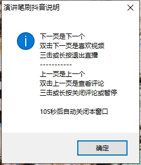

# Autokey 逍遥模拟器抖音刷视频演讲笔脚本
## 电脑条件
在电脑上安装了autokey和逍遥模拟器并安装好了抖音,系统分辨率1400*900,可根据自己电脑分辨率自行修改对应的x,y坐标,这里的坐标是用模拟器开全屏看抖音时候的坐标

## 演讲笔
一般的可翻页的ppt演讲笔,拥有下一页和上一页两个按键即可使用
## 功能简述
简单的切换视频(上一个/下一个),点赞视频/查看翻页退出评论/查看切换退出直播

## 使用方法
- 下一页按钮

  下一页是下一个视频

  双击下一页是喜欢视频

  三击或长按退出直播
- 上一页按钮

  上一页是上一个

  双击上一页是查看评论(直播页面双击可进入直播)

  三击或长按关闭评论或暂停

双击dy.ahk打开脚本,会有一个提示窗口,10S秒后自动关闭帮助信息

接着就可以全屏使用激光笔愉快的刷抖音了

